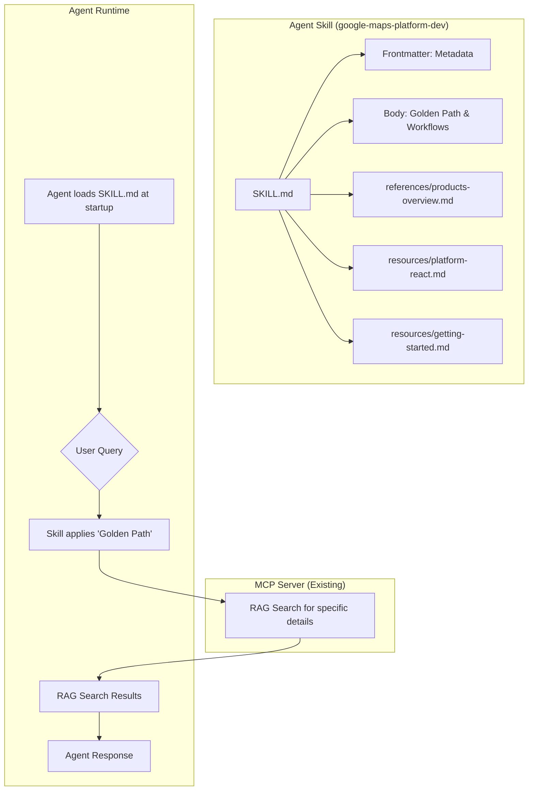

# Implementation Plan: Google Maps Platform Code Assist Agent Skill (Unified & Optimized)

## 1. Objective

Design and implement a **Unified & Optimized Agent Skill** (`google-maps-platform-dev`) that complements the Google Maps Platform Code Assist MCP server. This skill embeds foundational context, "Golden Path" recommendations, and expert workflows directly into the agent, adhering to the [AgentSkills.io](https://agentskills.io) specification.

**Key Benefits:**
- **Unified Guidance**: Covers Maps, Routes, Places, and Environment APIs in one skill.
- **"Golden Path" Defaults**: Enforces modern best practices (Vector Maps, Advanced Markers, Places UI Kit).
- **Reduced Latency**: Context is loaded at startup; no extra tool call required before query.
- **Cross-Platform**: Compatible with Gemini CLI, Claude Code, Cursor, Windsurf, and more.

---

## 2. Architecture Overview

### 2.1 Architecture Diagram



### 2.2 Key Architectural Decisions

| Decision | Choice | Rationale |
|----------|--------|-----------|
| Skill Name | `google-maps-platform-dev` | Clearly indicates development focus and distinguishes from generic maps skills |
| Context Strategy | "Golden Path" + Progressive Disclosure | Enforce modern defaults immediately; load deep references only on demand |
| References Structure | Product & Platform based | `products-overview.md` for capabilities, `platform-*.md` for implementation patterns |
| Tooling | MCP for Search | Skill handles strategy; MCP handles deep knowledge retrieval |

---

## 3. Specifications

### 3.1 Skill Directory Structure

```
skills/
└── google-maps-platform-dev/
    ├── SKILL.md                    # Main skill file (Unified instructions)
    ├── references/
    │   ├── products-overview.md    # API hierarchy & capabilities
    │   ├── places-overview.md      # Places API vs UI Kit decision guide
    │   ├── routes-navigation.md    # Routes vs Nav SDK decision guide
    │   ├── maps-grounding.md       # AI Grounding strategies
    │   └── ... (other topic refs)
    └── resources/
        ├── getting-started.md      # "DIRT Simple" API key guide
        ├── mcp-guide.md            # MCP installation help
        ├── platform-react.md       # React implementation patterns
        ├── platform-android-compose.md # Android Compose patterns
        └── ... (other platform patterns)
```

### 3.2 SKILL.md Features

The `SKILL.md` implements a strict "Constitution" and "Step-by-Step" workflow:

1.  **Analyze & Plan**: Identify platform and intent.
2.  **Credentials Check**: Mandatory check for API keys.
3.  **Golden Path Check**: Enforce Vector Maps, Advanced Markers, Places UI Kit.
4.  **Hypothesis-Driven Grounding**: Multi-pass retrieval strategy.
5.  **Component-Specific Grounding**: Consult specific references.
6.  **Implementation**: Use platform-specific resource patterns.

---

## 4. Implementation Tasks

> Tasks are ordered by dependency.

### Phase 1: Skill Foundation (Completed)

- [x] **Task 1.1**: Create Skill Directory Structure (`skills/google-maps-platform-dev/`)
- [x] **Task 1.2**: Draft SKILL.md Frontmatter (Metadata, Compatibility)
- [x] **Task 1.3**: Draft SKILL.md Body (Constitution, Golden Path, Workflows)

### Phase 2: Reference & Resource Files (Completed)

- [x] **Task 2.1**: Create Product References
  - `products-overview.md`, `places-overview.md`, `routes-navigation.md`, `environment-apis.md`
- [x] **Task 2.2**: Create Platform Resources
  - `platform-react.md`, `platform-android-compose.md`, `platform-ios-swiftui.md`
- [x] **Task 2.3**: Create Compliance & Best Practices
  - `eea-compliance.md`, `attribution.md` (renamed/integrated)
- [x] **Task 2.4**: Create Helper Resources
  - `getting-started.md` (API Key guide), `mcp-guide.md`

### Phase 3: MCP Server Updates (Completed)

- [x] **Task 3.1**: Bundle Skill with npm Package
  - Updated `package.json` to include `skills/` directory.

### Phase 4: Documentation & Distribution (In Progress)

- [ ] **Task 4.1**: Update README with Skill Instructions
  - Update paths to `google-maps-platform-dev`
  - Explain "Golden Path" benefits
- [ ] **Task 4.2**: Update Installation Guides
  - Gemini CLI, Claude Code, Cursor instructions
- [ ] **Task 4.3**: Submit to AgentSkills.io Registry (Optional)

---

## 5. Verification Strategy (Completed)

- [x] **Unit Verification**: YAML frontmatter valid, references exist.
- [x] **Safety Check**: No proprietary keys or internal links found.
- [x] **Integration Check**: Skill loads in Gemini CLI.

---

## 6. Future Considerations

### Post-v0.1 Roadmap
1. **v0.2**: Add `scripts/` for automated API key validation.
2. **v0.3**: Add "Solution Templates" (e.g., "Store Locator" scaffolding).
