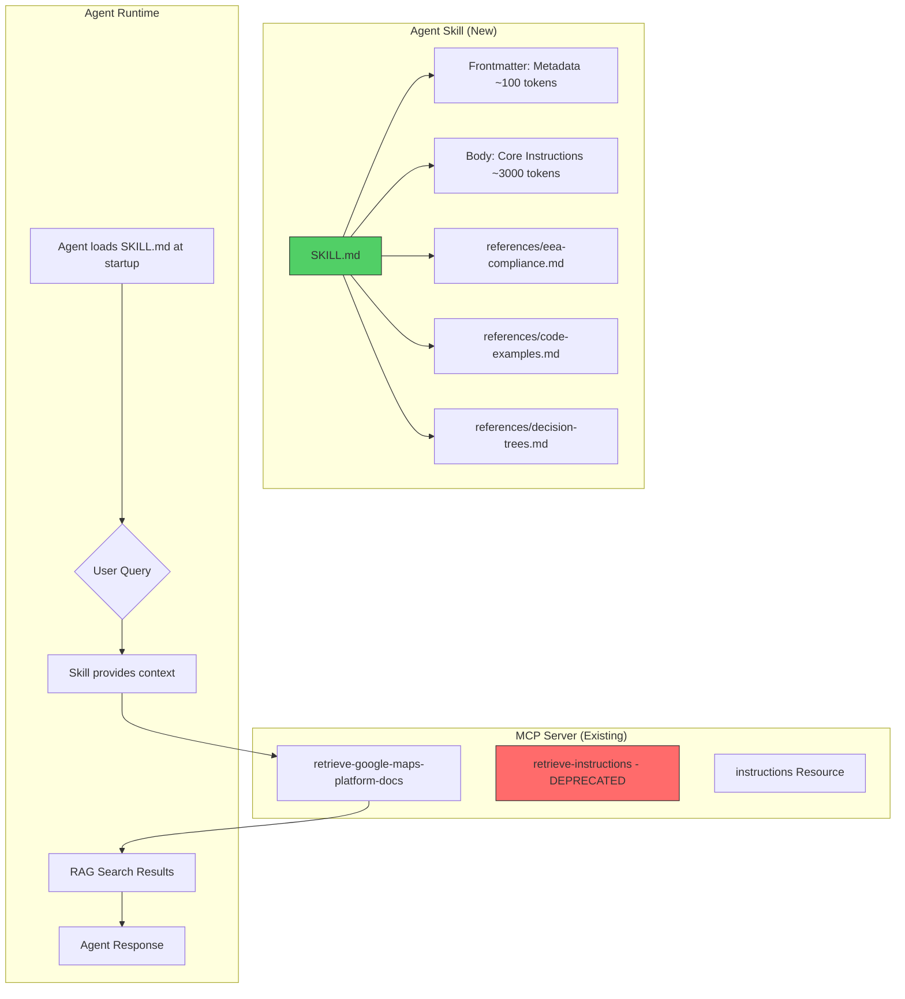

# Implementation Plan: Google Maps Platform Code Assist Agent Skill

## 1. Objective

Design and implement an **Agent Skill** that complements the Google Maps Platform Code Assist MCP server. The skill will embed foundational context (currently served by the `retrieve-instructions` tool) directly into the skill description and body, eliminating the need for an extra tool call before every query. This reduces latency, improves reliability, and follows the Anthropic Agent Skills specification (agentskills.io).

**Key Benefits:**
- **Reduced Latency**: No extra tool call required before using `retrieve-google-maps-platform-docs`
- **Improved Reliability**: Context is always available, even if the backend is slow/unavailable
- **Better Agent Experience**: Progressive disclosure pattern loads only necessary context
- **Cross-Platform Compatibility**: Works with Claude.ai, Claude Code, Cursor, Windsurf, VS Code, Roo, and any AgentSkills-compatible tool

---

## 2. Architecture Overview

### 2.1 Architecture Diagram



### 2.2 Key Architectural Decisions

| Decision | Choice | Rationale |
|----------|--------|-----------|
| Skill Specification | AgentSkills.io v1.0 | Open standard by Anthropic, cross-platform compatibility |
| Context Embedding Strategy | Progressive Disclosure | Level 1 (metadata) at startup, Level 2 (body) on activation, Level 3 (refs) on demand |
| `retrieve-instructions` Tool | Deprecate (keep for backward compat) | Skill replaces its functionality; keep tool for non-skill-aware agents |
| Skill Distribution | GitHub + npm package | Listed at agentskills.io/skills, bundled with MCP server |
| Token Budget | ~3500 tokens in SKILL.md body | Per spec recommendation (< 5000 tokens) |

### 2.3 Comparison: Current vs. Proposed Architecture

| Aspect | Current (Tool-based) | Proposed (Skill-based) |
|--------|---------------------|----------------------|
| Initial Context | Requires `retrieve-instructions` call | Loaded automatically at startup |
| Latency | 2 tool calls minimum | 1 tool call (just RAG search) |
| Failure Mode | Backend unavailable = no context | Context always available in skill |
| Token Efficiency | ~4000 tokens per session | ~100 tokens at startup, expand on demand |
| Cross-tool Support | Limited to MCP-aware tools | Any AgentSkills-compatible tool |

---

## 3. Specifications

### 3.1 Skill Directory Structure

```
skills/
└── google-maps-platform/
    ├── SKILL.md                    # Main skill file (required)
    ├── references/
    │   ├── eea-compliance.md       # EEA/Digital Markets Act requirements
    │   ├── code-examples.md        # Platform-specific code samples
    │   ├── decision-trees.md       # API selection decision trees
    │   └── attribution.md          # Attribution ID requirements
    └── assets/
        └── gmp-logo.png            # Optional branding
```

### 3.2 SKILL.md Frontmatter Schema

```yaml
---
name: google-maps-platform
description: >
  Expert assistant for Google Maps Platform APIs (Maps, Routes, Places).
  Provides guidance on API selection, implementation patterns, pricing,
  and best practices. Use the retrieve-google-maps-platform-docs tool
  for documentation search. Covers Web, Android, iOS, and Flutter SDKs.
version: 0.1.0
license: Apache-2.0
author: Google Maps Platform
compatibility:
  claude-code: ">=1.0.0"
  cursor: ">=0.40.0"
  windsurf: ">=1.0.0"
  roo-code: ">=3.0.0"
metadata:
  category: development
  tags:
    - google-maps
    - geolocation
    - maps
    - routes
    - places
    - sdk
  homepage: https://github.com/googlemaps/mcp-code-assist
  documentation: https://developers.google.com/maps
allowed-tools:
  - mcp--google-maps-platform-code-assist--retrieve-google-maps-platform-docs
  - mcp--googleMapsMcp--search_places
  - mcp--googleMapsMcp--compute_routes
  - mcp--googleMapsMcp--lookup_weather
---
```

### 3.3 SKILL.md Body Content (Condensed from mcp-instructions-prompt.xml)

The body will contain the following sections, condensed to ~3500 tokens:

```markdown
# Google Maps Platform Code Assist

## Role & Mission
You are an expert Google Maps Platform developer assistant...

## Core Principles
1. **Strict Grounding**: Only use information from official GMP documentation
2. **Decomposition**: Break complex queries into specific tool calls
3. **Conciseness**: Keep responses brief and code-focused
4. **Modernity**: Recommend latest APIs (AdvancedMarkerElement, not Marker)

## Absolute Rules (Constitution)
- NEVER hallucinate APIs, parameters, or pricing
- NEVER recommend deprecated APIs (google.maps.Marker, Directions Service for simple routes)
- ALWAYS include attribution ID: `gmp_mcp_codeassist_v0.1_github`
- ALWAYS verify EEA compliance requirements for EU users

## Quick Reference: API Selection

### Places API Decision Tree
- Need place details? → Places API (New) `places.googleapis.com`
- Need autocomplete? → Places Autocomplete (New) with session tokens
- Need nearby search? → Nearby Search (New) with field masks

### Routes API Decision Tree  
- Simple A→B route? → Routes API `routes.googleapis.com`
- Need turn-by-turn nav? → Navigation SDK (mobile only)
- Route optimization? → Route Optimization API

### Maps Display Decision Tree
- Web map? → Maps JavaScript API with Dynamic Library Import
- Mobile map? → Maps SDK for Android/iOS
- Custom overlays? → Deck.gl + Maps JavaScript API

## Tool Usage
Use `retrieve-google-maps-platform-docs` for:
- API documentation lookup
- Code samples for specific platforms
- Pricing and quota information
- Migration guides

For extended context, reference:
- `references/eea-compliance.md` - EU Digital Markets Act requirements
- `references/code-examples.md` - Platform-specific code patterns
- `references/decision-trees.md` - Detailed API selection flowcharts
```

### 3.4 Reference Files Content

#### `references/eea-compliance.md`
Contains the full EEA/Digital Markets Act compliance requirements from [`eea-compliance.ts`](prompts/universal/eea-compliance.ts).

#### `references/code-examples.md`
Contains condensed code examples from [`canonical-examples.ts`](prompts/examples/canonical-examples.ts) for:
- Web (JavaScript Dynamic Library Import)
- Android (Kotlin with Compose)
- iOS (Swift with SwiftUI)
- Flutter (Dart)

#### `references/decision-trees.md`
Contains detailed decision trees from [`decision-trees.ts`](prompts/universal/decision-trees.ts) for:
- Places API selection
- Routes API selection
- Data visualization selection

#### `references/attribution.md`
Contains attribution ID requirements from [`attribution.ts`](prompts/attribution.ts).

### 3.5 MCP Server Changes

| Change | Type | Description |
|--------|------|-------------|
| `retrieve-instructions` tool | Deprecate | Add deprecation notice, keep for backward compat |
| Tool description update | Modify | Remove "MUST call retrieve-instructions first" |
| Skill export | Add | Bundle skill directory with npm package |

---

## 4. Implementation Tasks

> Tasks are ordered by dependency. Complete each task fully before starting dependent tasks.

### Phase 1: Skill Foundation

- [ ] **Task 1.1**: Create Skill Directory Structure
  - **Description**: Create `skills/google-maps-platform/` directory with subdirectories for references and assets
  - **Files**: 
    - `skills/google-maps-platform/` (create directory)
    - `skills/google-maps-platform/references/` (create directory)
    - `skills/google-maps-platform/assets/` (create directory)
  - **Acceptance Criteria**: Directory structure matches spec in 3.1
  - **Verification**: `ls -la skills/google-maps-platform/`
  - **Dependencies**: None

- [ ] **Task 1.2**: Draft SKILL.md Frontmatter
  - **Description**: Create SKILL.md with YAML frontmatter following AgentSkills.io spec
  - **Files**: `skills/google-maps-platform/SKILL.md` (create)
  - **Acceptance Criteria**: 
    - Valid YAML frontmatter
    - `name` ≤ 64 chars, lowercase with hyphens
    - `description` ≤ 1024 chars
    - All required fields present
  - **Verification**: Parse YAML with `npx js-yaml skills/google-maps-platform/SKILL.md`
  - **Dependencies**: Task 1.1

- [ ] **Task 1.3**: Draft SKILL.md Body (Core Instructions)
  - **Description**: Condense content from `prompts/generated/mcp-instructions-prompt.xml` into ~3500 token body.
    - Heavily condense `agentic_reasoning` section (focus on outcomes).
    - Merge `production-readiness.ts` content into a "Best Practices" section.
    - Move verbose `tool_examples` to references.
  - **Files**: `skills/google-maps-platform/SKILL.md` (modify)
  - **Acceptance Criteria**:
    - Body includes: Role, Core Principles, Constitution, Quick Reference, Tool Usage, Best Practices
    - Token count < 5000 (use `tiktoken` to verify)
    - No redundant content with frontmatter description
  - **Verification**: Token count check, manual review for completeness
  - **Dependencies**: Task 1.2

### Phase 2: Reference Files

- [ ] **Task 2.1**: Create EEA Compliance Reference
  - **Description**: Extract EEA compliance content from `prompts/universal/eea-compliance.ts` into markdown
  - **Files**: `skills/google-maps-platform/references/eea-compliance.md` (create)
  - **Acceptance Criteria**: Complete EEA/DMA requirements, properly formatted markdown
  - **Verification**: Content matches source file, renders correctly
  - **Dependencies**: Task 1.1

- [ ] **Task 2.2**: Create Code Examples Reference
  - **Description**: Extract and condense code examples from `prompts/examples/` and `tool_examples` from prompt into single reference file
  - **Files**: `skills/google-maps-platform/references/code-examples.md` (create)
  - **Acceptance Criteria**:
    - Includes Web, Android, iOS, Flutter examples
    - Includes few-shot tool usage examples from `mcp-instructions-prompt.xml`
    - Each example is minimal but functional
    - Attribution ID included in all examples
  - **Verification**: Code syntax highlighting works, examples are valid
  - **Dependencies**: Task 1.1

- [ ] **Task 2.3**: Create Decision Trees Reference
  - **Description**: Extract decision trees from `prompts/universal/decision-trees.ts` into markdown with Mermaid diagrams
  - **Files**: `skills/google-maps-platform/references/decision-trees.md` (create)
  - **Acceptance Criteria**: 
    - Places, Routes, and Data Viz decision trees included
    - Uses Mermaid or ASCII art for visualization
  - **Verification**: Mermaid diagrams render correctly
  - **Dependencies**: Task 1.1

- [ ] **Task 2.4**: Create Attribution Reference
  - **Description**: Extract attribution requirements from `prompts/attribution.ts`
  - **Files**: `skills/google-maps-platform/references/attribution.md` (create)
  - **Acceptance Criteria**: 
    - Attribution ID clearly documented
    - Platform-specific integration code included
  - **Verification**: Content matches source, code examples valid
  - **Dependencies**: Task 1.1

### Phase 3: MCP Server Updates

- [ ] **Task 3.1**: Deprecate retrieve-instructions Tool
  - **Description**: Add deprecation notice to `retrieve-instructions` tool description, keep functional for backward compatibility
  - **Files**: `index.ts` (modify)
  - **Acceptance Criteria**: 
    - Tool description includes "[DEPRECATED]" prefix
    - Tool still functions normally
    - Description mentions skill alternative
  - **Verification**: `npm run build && npm test`
  - **Dependencies**: Tasks 1.1-1.3

- [ ] **Task 3.2**: Update retrieve-google-maps-platform-docs Tool Description
  - **Description**: Remove "MUST call retrieve-instructions first" requirement from tool description
  - **Files**: `index.ts` (modify)
  - **Acceptance Criteria**: 
    - Tool description no longer requires prior tool call
    - Description mentions skill provides context
  - **Verification**: `npm run build && npm test`
  - **Dependencies**: Task 3.1

- [ ] **Task 3.3**: Bundle Skill with npm Package
  - **Description**: Update package.json to include skills directory in published package
  - **Files**: `package.json` (modify)
  - **Acceptance Criteria**: 
    - `files` array includes `skills/`
    - Skill files included in `npm pack` output
  - **Verification**: `npm pack && tar -tzf *.tgz | grep skills`
  - **Dependencies**: Tasks 1.1-2.4

### Phase 4: Documentation & Distribution

- [ ] **Task 4.1**: Update README with Skill Instructions
  - **Description**: Add section to README explaining skill installation and usage
  - **Files**: `README.md` (modify)
  - **Acceptance Criteria**: 
    - Installation instructions for each supported tool (Cursor, VS Code, etc.)
    - Explains relationship between skill and MCP server
  - **Verification**: Manual review, links work
  - **Dependencies**: Tasks 1.1-3.3

- [ ] **Task 4.2**: Create Skill Changelog Entry
  - **Description**: Add changelog entry for skill release
  - **Files**: `CHANGELOG.md` (modify)
  - **Acceptance Criteria**: Follows existing changelog format
  - **Verification**: Manual review
  - **Dependencies**: Tasks 1.1-3.3

- [ ] **Task 4.3**: Document Skill Installation
  - **Description**: Add specific instructions for installing the skill in common agents (Claude, Cursor, etc.)
  - **Files**: `README.md` (modify)
  - **Acceptance Criteria**: Clear copy-paste instructions for skill installation
  - **Verification**: Manual review
  - **Dependencies**: Tasks 1.1-3.3

- [ ] **Task 4.4**: Submit to AgentSkills.io Registry (Optional)
  - **Description**: Submit skill to agentskills.io/skills for public listing
  - **Files**: None (external submission)
  - **Acceptance Criteria**: Skill listed on registry
  - **Verification**: Skill visible at agentskills.io/skills
  - **Dependencies**: Tasks 1.1-4.3

- [ ] **Task 4.5**: Update Backlog
  - **Description**: Add item to backlog for future removal of `retrieve-instructions` tool (v1.0).
  - **Files**: `BACKLOG.md` (create/update)
  - **Acceptance Criteria**: Explicitly states `retrieve-instructions` is deprecated but kept for compatibility until v1.0.
  - **Verification**: Manual review
  - **Dependencies**: Tasks 1.1-3.3

---

## 5. Verification Strategy

### 5.1 Unit Verification
1. **SKILL.md Validation**:
   ```bash
   # Verify YAML frontmatter
   npx js-yaml skills/google-maps-platform/SKILL.md
   
   # Check token count (should be < 5000)
   npx tiktoken-cli count skills/google-maps-platform/SKILL.md
   ```

2. **Reference File Validation**:
   ```bash
   # Verify all reference files exist
   ls -la skills/google-maps-platform/references/
   
   # Check for valid markdown
   npx markdownlint skills/google-maps-platform/**/*.md
   ```

3. **MCP Server Tests**:
   ```bash
   npm run build
   npm test
   ```

### 5.2 Integration Verification
1. **Load Skill in Claude Code**:
   ```bash
   # Install skill locally
   cp -r skills/google-maps-platform ~/.claude/skills/
   
   # Verify skill is recognized
   claude skill list
   ```

2. **Test Query Without retrieve-instructions**:
   - Query: "How do I add a marker to a Google Map in JavaScript?"
   - Expected: Agent uses skill context + `retrieve-google-maps-platform-docs`
   - Verify: No call to `retrieve-instructions` tool

3. **Test Reference Loading**:
   - Query: "What are the EEA compliance requirements for Google Maps?"
   - Expected: Agent loads `references/eea-compliance.md` on demand
   - Verify: Complete EEA requirements in response

### 5.3 Cross-Platform Verification
Test skill loading in:
- [ ] Claude Code CLI
- [ ] Cursor
- [ ] Windsurf
- [ ] VS Code with Continue extension
- [ ] Roo Code

---

## 6. Risks and Open Questions

| Risk/Question | Mitigation/Answer Needed |
|---------------|-------------------------|
| **Token budget exceeded** | Aggressively condense content; move verbose sections to references |
| **AgentSkills.io spec changes** | Monitor spec, design for extensibility |
| **Backward compatibility** | Keep `retrieve-instructions` tool functional; deprecation period before removal |
| **Tool naming conventions** | Verify `allowed-tools` format matches MCP tool naming across platforms |
| **Skill activation timing** | Confirm skill body is loaded before first tool call |
| **Reference file discovery** | Document reference syntax; test in multiple tools |

---

## 7. Future Considerations

### Out of Scope (v0.1)
- **Interactive skill commands**: Future spec may support `/gmp-help` style commands
- **Skill versioning**: Handle multiple skill versions per tool
- **Dynamic skill updates**: Hot-reload skill without restarting agent
- **Skill composition**: Combining with other skills (e.g., Firebase skill)

### Post-v0.1 Roadmap
1. **v0.2**: Add `scripts/` directory for automated setup (API key validation, etc.)
2. **v0.3**: Add skill-specific prompts for different use cases (mobile, web, enterprise)
3. **v1.0**: Full deprecation of `retrieve-instructions` tool

---

## 8. Appendix: Research Summary

### 8.1 AgentSkills.io Specification Key Points
- **SKILL.md required fields**: `name`, `description`
- **Token recommendations**: < 5000 tokens in body
- **Progressive disclosure**: Metadata → Body → References
- **Compatibility field**: Specify minimum versions for each tool

### 8.2 Phil Schmid's MCP Best Practices Applied
- **Instructions are Context**: Skill description IS the instruction
- **Curate Ruthlessly**: One focused skill > many vague skills
- **Name Tools for Discovery**: Skill name is discoverable (`google-maps-platform`)

### 8.3 Content Sources
| Content | Source File | Destination |
|---------|-------------|-------------|
| Core instructions | `prompts/generated/mcp-instructions-prompt.xml` | SKILL.md body |
| EEA compliance | `prompts/universal/eea-compliance.ts` | references/eea-compliance.md |
| Code examples | `prompts/examples/*.ts` | references/code-examples.md |
| Decision trees | `prompts/universal/decision-trees.ts` | references/decision-trees.md |
| Attribution | `prompts/attribution.ts` | references/attribution.md |
