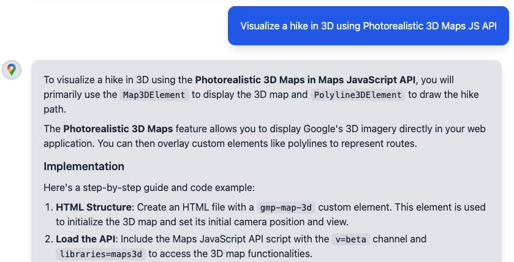

[][license]
[][Discord server]
[](https://cursor.com/en/install-mcp?name=google-maps-platform&config=eyJ0eXBlIjoic3NlIiwidXJsIjoiaHR0cHM6Ly9tYXBzY29kZWFzc2lzdC5nb29nbGVhcGlzLmNvbS9tY3AifQ==)

#  Google Maps Platform Code Assist Toolkit

<!-- [START maps_Description] -->

## Description

Make your Agent a Google Maps Platform development expert. The Google Maps Platform Code Assist is a Model Context Protocol (MCP) server that enhances the responses from large language models (LLMs) used for developing applications with the Google Maps Platform by grounding the responses in the official, up-to-date documentation and code samples. 

Google Maps Platform resources that Agents can access with Code Assist MCP include:

- Google Maps Platform Documentation
- Google Maps Platform Terms of Service
- Google Maps Platform Trust Center
- Code repositories in Google Maps Platform official GitHub organizations
<!-- [END maps_Description] -->

<!-- [START maps_CTADevelopers] -->

## Benefits

- Make your favorite AI assistant or IDE an expert on the Google Maps Platform. With Code Assist, AI Agents like Gemini CLI, Claude Code, and Cursor can generate code and answer developer questions grounded in up-to-date, official Google Maps Platform documentation and code samples -- directly in your dev workflow.

- When you are coding with AI Agent assistance, Code Assist can help you accomplish your task faster and easier.

<!-- [START_EXCLUDE] -->

Below is an example MCP Client response to a user's question with Code Assist MCP installed:



<!-- [END_EXCLUDE] -->
<!-- [END maps_CTADevelopers] -->

---

<!-- [START maps_Tools] -->

## Tools Provided

The MCP server exposes the following tools for AI clients:

1. **`retrieve-instructions`**: Retrieves foundational context on Google Maps Platform best practices.
   - *Parameters*:
     - `name` (Required string, expected format is simply "instructions").
2. **`retrieve-google-maps-platform-docs`**: Searches Google Maps Platform documentation, code samples, architecture center, and GitHub repositories via RAG.
   - *Parameters*:
     - `llmQuery` (Required string query),
     - `filter` (Optional API/product area filter)
     - `source` (Optional string caller identifier up to 64 chars).
   <!-- [END maps_Tools] -->

---

<!-- [START maps_Transports] -->

## Supported MCP Transports

- **`streamable HTTP`**: The server exposes a `/mcp` endpoint that accepts POST requests over the HTTPS protocol. See more details in the [Transports doc of the MCP spec](https://modelcontextprotocol.io/specification/2025-03-26/basic/transports#streamable-http).

<!-- [END maps_Transports] -->

---

<!-- [START maps_RemoteSetup] -->

## Usage

> [!WARNING]
> We will be deprecating the NPM version of Code Assist. It will no longer be available as of [XX date - to be completed]. Please use the remote streamable HTTP version at `https://mapscodeassist.googleapis.com/mcp`.

The Code Assist MCP server is securely hosted by Google. No authentication is required. To use it, you must configure your AI client to connect to the remote URL via streamable HTTP.

### Configure Your Client

Add the remote server URL to your preferred AI client's MCP configuration file or settings UI. Find your client below for specific, verified instructions.

1. **Gemini CLI**
   - Option 1 (Recommended) - Install the Code Assist MCP server as a Gemini CLI extension. This provides the most complete experience, including specialized developer skills:
     ```bash
     gemini extensions install https://github.com/googlemaps/platform-ai.git
     ```
     _(Alternatively, you can install it directly from the Extension Marketplace using `gemini extensions install google-maps-platform`)_
   - Option 2 - Use the `mcp add` CLI command to add the server cleanly:
     ```bash
     gemini mcp add --transport http gmp-code-assist https://mapscodeassist.googleapis.com/mcp
     ```
   - Option 3 - Add the MCP server config manually to your `~/.gemini/settings.json` file (or `.gemini/settings.json` in your project root).

   ```json
   {
     "mcpServers": {
       "gmp-code-assist": {
         "httpUrl": "https://mapscodeassist.googleapis.com/mcp"
       }
     }
   }
   ```

2. **Claude Code**
   - The cleanest way to add the remote server is via the `mcp add` CLI command:
     ```bash
     claude mcp add gmp-code-assist http https://mapscodeassist.googleapis.com/mcp
     ```
   - Alternatively, add the server manually to your Claude config file `~/.claude.json`:

   ```json
   {
     "mcpServers": {
       "gmp-code-assist": {
         "type": "streamable-http",
         "url": "https://mapscodeassist.googleapis.com/mcp"
       }
     }
   }
   ```

3. **Cursor**
   - [](https://cursor.com/en/install-mcp?name=google-maps-platform&config=eyJ0eXBlIjoiaHR0cCIsInVybCI6Imh0dHBzOi8vbWFwc2NvZGVhc3Npc3QuZ29vZ2xlYXBpcy5jb20vbWNwIn0=) <-- If you already have Cursor installed, click here to install the Google Maps Platform Code Assist MCP directly.
   - Otherwise, add it to your workspace's `.cursor/mcp.json` file.

   ```json
   {
     "mcpServers": {
       "gmp-code-assist": {
         "type": "http",
         "url": "https://mapscodeassist.googleapis.com/mcp"
       }
     }
   }
   ```

4. **Codex**
   - The easiest way to connect Codex to the remote server is via the CLI:
     ```bash
     codex mcp add gmp-code-assist --url https://mapscodeassist.googleapis.com/mcp
     ```
   - If you prefer manual configuration, add the following to your `~/.codex/config.toml` or your project's `.codex/config.toml`:

   ```toml
   [mcp_servers.gmp-code-assist]
   transport = "http"
   url = "https://mapscodeassist.googleapis.com/mcp"
   ```

5. **Antigravity**
   - The easiest way to install is via the built-in MCP Store: Open the `...` menu in the agent panel, select **MCP Servers**, find **Google Maps Platform**, and click **Install**.
   - Alternatively, add the streamable HTTP endpoint to your `mcp_config.json`:

   ```json
   {
     "mcpServers": {
       "gmp-code-assist": {
         "type": "streamable-http",
         "url": "https://mapscodeassist.googleapis.com/mcp"
       }
     }
   }
   ```

6. **Android Studio**
   - Go to **File** (or Android Studio on macOS) > **Settings** > **Tools** > **AI** > **MCP Servers**.
   - Select **Enable MCP Servers**.
   - Add the configuration. This will be saved in your Android Studio's `mcp.json` file:

   ```json
   {
     "mcpServers": {
       "gmp-code-assist": {
         "httpUrl": "https://mapscodeassist.googleapis.com/mcp"
       }
     }
   }
   ```

<!-- [END maps_RemoteSetup] -->

---

<!-- [START maps_Terms] -->

## **Terms of Service**

This toolkit provides tools to describe the use of Google Maps Platform services. Use of Google Maps Platform services is subject to the Google Maps Platform [Terms of Service](https://cloud.google.com/maps-platform/terms). If your billing address is in the European Economic Area, the Google Maps Platform [EEA Terms of Service](https://cloud.google.com/terms/maps-platform/eea) will apply to your use of the Services. Functionality varies by region.

This toolkit is not a Google Maps Platform Core Service. Therefore, the Google Maps Platform Terms of Service (such as Technical Support Services, Service Level Agreements, and Deprecation Policy) do not apply to the code in this repository or the RAG service called by it.

<!-- [END maps_Terms] -->

## **Support**

<!-- [START maps_Support] -->

This toolkit is offered via an open source [license](https://github.com/googlemaps/.github/blob/master/LICENSE). It is not governed by the Google Maps Platform Support (Technical Support Services Guidelines, the SLA, or the [Deprecation Policy](https://cloud.google.com/maps-platform/terms)). However, any Google Maps Platform services used by the library remain subject to the Google Maps Platform Terms of Service.

If you find a bug, or have a feature request, please [file an issue](https://github.com/googlemaps/platform-ai/issues/new/choose) on GitHub. If you would like to get answers to technical questions from other Google Maps Platform developers, ask through one of our [developer community channels](https://developers.google.com/maps/developer-community). If you'd like to contribute, please check the [contributing guide](https://github.com/googlemaps/.github/blob/master/CONTRIBUTING.md).

You can also discuss this toolkit on our [Discord server](https://discord.gg/hYsWbmk).

<!--constant anchor links-->

[Discord server]: https://discord.gg/hYsWbmk
[license]: LICENSE

<!-- [END maps_Support] -->
